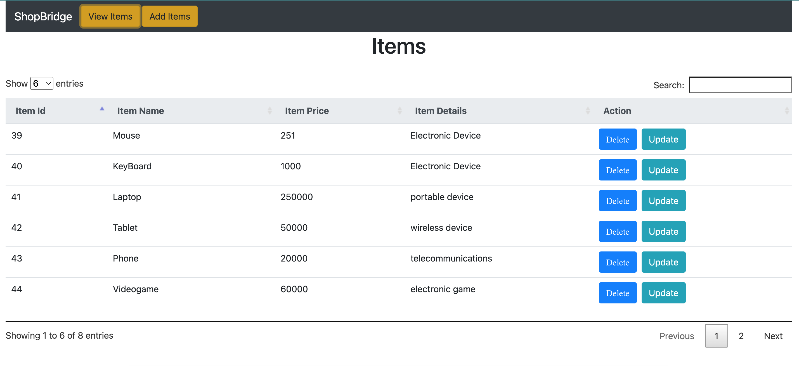
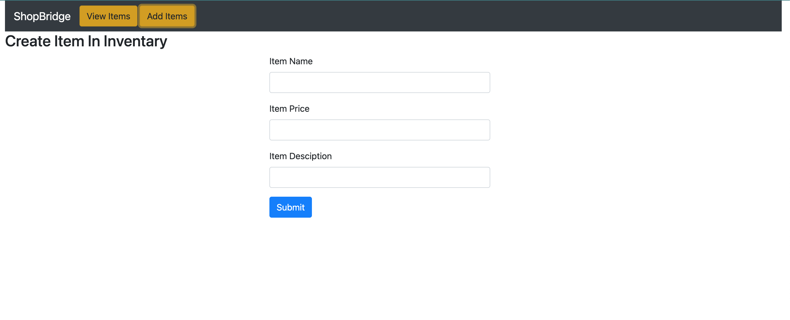

# crud_project

Steps for Front End - 
1.Open Angular Folder project on visual studio code 
2.open terminal and serve the project using ng serve
3.after succesfully serve open your browser on http://localhost:4200/

Steps for BackEnd - 
1.Open this project on Spring Boot
2.Change the application properties 
3.Import sql file and view table on phpmyadmin 
4.Run api on postman

Details -
I have created this project using FrontEnd Backend and Database,
for FrontEnd i use - Angular (VisualStudioCode)
for BackEnd i use - Java (SpringBoot)
for Database MySql (phpMyAdmin)

About -
We can Create, Read, Update & Delete the items using this project.

ScreenShots for reference purpose -

